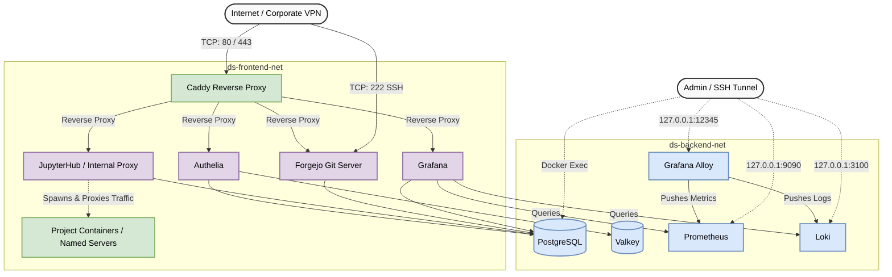

# Data Science Platform Administrator Guide


This document serves as a reference for the deployment, maintenance, operation, and scaling of the Data Science Platform. 

**What it is:** A production-ready, single-node Data Science platform deployed via Ansible and Docker Compose. It provides an isolated, reproducible, and collaborative workspace environment for data science teams without the overhead of Kubernetes.

### Key Features

**Workspace & Dependency Management**
* **Modern Package Management:** Uses `uv` for blazing-fast, reproducible system-level Python environment building. Astral's official `uv` Docker images serve as the foundation, and `uv` handles dependency resolution both during the initial build and at runtime inside the user containers (Named Servers).
* **Custom JupyterHub Enhancements:** Features a custom `DockerSpawner` class and pre-spawn hook implementing logic for seamless server resumption, handling orphaned (deleted) containers, and performing Git setup automation (among other *opinionated* design decisions).
* **Automated Image Management & Registry:** Comes with a pre-configured selection of project images. An automated Ansible pipeline calculates checksums, builds, and pushes images directly to the integrated Forgejo Container Registry.
* **Declarative Environment Customization:** Adding, modifying, and managing user environments requires zero boilerplate --- it is as easy as updating dependencies in a centralized Ansible YAML configuration. An Ansible pipeline uses a single `universal_Dockerfile.j2` and a recursive `universal_pyproject.toml.j2` to dynamically generate image types based on a central YAML dictionary.
* **Dynamic GPU Provisioning:** The custom `DockerSpawner` dynamically detects if a user has selected a GPU-enabled image (denoted by the `-gpu` suffix) and automatically injects a `DeviceRequest` to mount the host's NVIDIA GPUs into the container at runtime.

**Identity & Security**
* **Zero-Touch Git Identity:** Auto-generates SSH keys and syncs user identities to the internal Git server on container (Named Server) startup.
* **Seamless SSO:** Integrated OIDC Single Sign-On across all services via Authelia, including a custom global logout chain (iframe/fetch-based) to ensure secure session termination across all subdomains.
* **Automated Database Provisioning:** Database initialization is fully automated via a custom script that provisions individual databases and users for Authelia, Forgejo, JupyterHub, and Grafana on the very first startup.

**Infrastructure & Orchestration**
* **Robust Container Orchestration:** The core `docker-compose.yml` configuration is heavily hardened, featuring explicit healthchecks, wait conditions, and CPU/Memory limits and reservations for every service, bringing production-grade stability (as far as a single-node deployment goes).
* **Automated Disaster Recovery:** Nightly, deduplicated Restic backups for configuration, databases, and user data.

**Observability**
* **Unified Telemetry with Grafana Alloy:** Uses Grafana Alloy as the single unified agent for all log and metric collection. It leverages Alloy's built-in cAdvisor and Node Exporter components to capture rich host and container metrics without running separate containers.
* **Pre-configured Observability & Alerting:** Full metrics and logging pipeline using Grafana, Prometheus, Loki, and Alloy. Includes out-of-the-box Grafana dashboards for Host, Container, and Logging metrics, plus pre-configured alerting rules mapped to a webhook contact point (defaults to MS Teams template, but easily adaptable to other contact points, e.g., Slack).

### The Tech Stack
* **Workspace:** JupyterHub
* **Version Control:** Forgejo (Self-hosted Git & Container Registry)
* **Authentication:** Authelia (SSO / OIDC)
* **Observability:** Grafana, Prometheus, Loki, and Alloy
* **Databases/Cache:** PostgreSQL 18, Valkey 9
* **Reverse Proxy:** Caddy (with automated Let's Encrypt or custom TLS)

---

## Quick Start (TLDR)

If you are setting this up on a fresh VM, here is the high-level deployment flow. *(See Section 2 for detailed, step-by-step instructions).*

1. **Provision a Debian 12 VM** with Docker, Ansible, Git, and Make installed.

2. **Clone the repository** and navigate to its root directory.

3. **Initialize Secrets:**
   ```bash
   # Create your vault password file
   read -s -p "Enter a strong Vault password: " val && echo "$val" > secrets/.vault_pass
   chmod 600 secrets/.vault_pass

   # Initialize and encrypt the vault
   cp secrets/vault.yml.example secrets/vault.yml
   ansible-vault encrypt secrets/vault.yml
   
   # Set your specific passwords and OIDC secrets
   make vault-edit  
   ```

4. **Configure the Environment:**
   ```bash
   cp ansible/group_vars/all.yml.example ansible/group_vars/all.yml
   vi ansible/group_vars/all.yml  # Set your parent_domain and feature flags
   ```

5. **Deploy the Platform:**
   ```bash
   make deploy
   ```
---

## Table of Contents

- [Key Features](#key-features)
- [The Tech Stack](#the-tech-stack)
- [Quick Start (TLDR)](#quick-start-tldr)
- [1. System Architecture & Prerequisites](#1-system-architecture--prerequisites)
  - [1.1. Network & IT Requirements](#11-network--it-requirements)
  - [1.2. Security Architecture (Loopback Binding)](#12-security-architecture-loopback-binding)
- [2. Host Setup](#2-host-setup)
  - [2.1. VM Specifications](#21-vm-specifications)
  - [2.2. Critical Software Versions](#22-critical-software-versions)
  - [2.3. Initial Setup & Installs](#23-initial-setup--installs)
  - [2.4. Platform Setup](#24-platform-setup)
  - [2.5 Configuration Reference](#25-configuration-reference)
- [3. Routine Management (The Makefile)](#3-routine-management-the-makefile)
- [4. User Management](#4-user-management)
  - [4.1. Adding a New User](#41-adding-a-new-user)
  - [4.2. Offboarding](#42-offboarding)
- [5. Image & Environment Customization](#5-image--environment-customization)
  - [5.1. Updating Existing Images](#51-updating-existing-images)
  - [5.2. Creating a New Image Type](#52-creating-a-new-image-type)
  - [5.3. Injecting File into User Containers](#53-injecting-file-into-user-containers)
- [6. Disaster Recovery & Migration](#6-disaster-recovery--migration)
  - [6.1 Backup Verification (Drill)](#61-backup-verification-drill)
  - [6.2. Migration Guide](#62-migration-guide)
  - [6.3. Full System Restoration (Disaster Recovery & Migration)](#63-full-system-restoration-disaster-recovery--migration)
- [7. Database Administration](#7-database-administration)
  - [7.1. Connecting to Postgres](#71-connecting-to-postgres)
  - [7.2. Connecting to Valkey (Redis)](#72-connecting-to-valkey-redis)
- [8. Admin UI Access via SSH Tunneling](#8-admin-ui-access-via-ssh-tunneling)
- [9. Maintenance Operations](#9-maintenance-operations)
  - [9.1 TLS Certificate Rotation](#91-tls-certificate-rotation)
  - [9.2 System Updates (OS Patching)](#92-system-updates-os-patching)
- [10. Platform Internals & Advanced Workflows](#10-platform-internals--advanced-workflows)
  - [10.1 Identity & Access Management (IAM) Internals](#101-identity--access-management-iam-internals)
  - [10.2 Automation & Custom Scripts](#102-automation--custom-scripts)
  - [10.3 Image Building Strategy](#103-image-building-strategy)
  - [10.4 Observability Pipeline (Alloy)](#104-observability-pipeline-alloy)
- [11. Troubleshooting](#11-troubleshooting)
  - [11.1 Using the Makefile Administration Interface](#111-makefile-admin--troubleshoot)
  - [11.2 Debugging Spawned User Containers (Named Servers)](#112-debugging--user-containers)
  - [11.3 Database, Cache, and Telemetry Diagnostics](#113-diagnostics)
  - [11.4 Common Pitfalls & Solutions](#114-common-pitfalls)
- [12. License & Contributions](#12-license--contributions)
  - [12.1 License](#121-license)
  - [12.2 Contributing](#122-contributing)
  - [12.3 Reporting Issues & Support](#123-reporting-issues--support)
  - [12.4 Security Vulnerabilities](#124-security-vulnerabilities)

---

## 1. System Architecture & Prerequisites

### 1.1. Network & IT Requirements

Before deploying or migrating this platform, the following infrastructure requirements must be fulfilled (in a corporate setting, commonly by the IT/Network team):

* **DNS & Subdomains:** The following subdomains must be registered and point to the VM's **Static IP**:
* `jupyter.mydomain.com` (Workspace)
* `git.mydomain.com` (Version Control)
* `monitoring.mydomain.com` (Observability)
* `auth.mydomain.com` (SSO/Authentication)
*Note: Ensure `mydomain.com` is correctly set in `/ansible/group_vars/all.yml` config file, under `parent_domain` variable.*

* **TLS Certificates:** The platform supports two modes of HTTPS encryption, controlled by the `use_custom_certs` variable in `/ansible/group_vars/all.yml`:
  * **Automated (Let's Encrypt):** (Set `use_custom_certs: false`). The Caddy reverse proxy will automatically request, provision, and renew certificates. Requires a valid `acme_email` in the config.
  * **Custom/Corporate Certificates:** (Set `use_custom_certs: true`). You must provision a valid wildcard or SAN certificate. Place the files in `secrets/certs/` and ensure `cert.pem` and `cert.key` are correctly set in `/ansible/group_vars/all.yml`.

* **Firewall & Ports:**
* **Inbound:** Allow TCP `80`, `443` (Web), and `222` (SSH-over-Git) from the internal VPN range or network. *Note: When using Automated TLS (Let's Encrypt), Port 80 must be accessible from the public internet for ACME HTTP-01 challenges. Otherwise, internal VPN access is sufficient.*
* **Outbound:** The VM requires general internet access (HTTP/HTTPS) for downloading Python packages and Docker images.
* **SMTP:** Access to the SMTP server (Port `587`, STARTTLS) for email notifications.

### 1.2. Security Architecture (Loopback Binding)

To minimize the attack surface, **only** the Caddy Reverse Proxy container listens on the public network interface.

* **Backend Services:** All user-facing services (JupyterHub, Forgejo, Grafana, Authelia) are configured to listen **exclusively on `127.0.0.1` (localhost)** or within the internal Docker network.
* **Reverse Proxy:** Caddy handles TLS termination and routes traffic to these internal ports.
* **DNS Hairpinning:** The `extra_hosts` configuration in Docker Compose resolves internal domain calls (e.g., JupyterHub talking to Authelia) to the host gateway. This ensures traffic stays within the VM, avoiding external firewall blocks on NAT loopback.

**Traffic Flow Diagram:**

```text
[Internet / Corporate VPN] 
             |              |
     [TCP: 80/443]    [TCP: 222 (SSH)]
             |              |
   [Caddy Reverse Proxy]    |
             |              |
(Docker: ds-frontend-net)   |
  |----------|----------|---|------|
  |          |          |          |
[Auth]  [JupyterHub] [Forgejo] [Grafana]
             |
         (Spawns)
             |
    [Project Containers]

=============================================
 (Dual-Homed Services connecting to Backend)
=============================================
  |          |          |          |
[Auth]  [JupyterHub] [Forgejo] [Grafana]
  |          |          |          |
(Docker: ds-backend-net)           |
  |----------|----------|----------|
  |          |          |
[DBs]     [Cache]  [Observability]
(Postgres) (Valkey) (Alloy/Prom/Loki)
                        |
            (127.0.0.1 Admin Binding)
               [SSH Tunnel Access]
```



---

## 2. Host Setup

### 2.1. VM Specifications

* **OS:** Debian 12 (Bookworm) or newer.
* **Resources:** Minimum 8 vCPU, 32GB RAM (64GB recommended), 100GB+ Storage.

### 2.2. Critical Software Versions

The automation relies on specific versions of Ansible and Python features that may be newer than the default Debian 12 repositories.

* **Python:** 3.11+
* **Ansible Core:** 2.17+
* **Ansible Community Docker Collection:** 3.13+
* **Jinja2:** 3.1+

### 2.3. Initial Setup & Installs

*Note: During initial implementation, standard Debian repositories provided outdated software versions. The following steps utilize an external PPA to ensure compatibility.*

1. **Create the Infrastructure Admin User:**
    ```bash
    useradd -m -s /bin/bash infra-admin
    passwd infra-admin
    usermod -aG sudo infra-admin
    ```

2. **Install Base Dependencies**
    ```bash
    sudo apt-get update
    sudo apt-get install -y ca-certificates curl make gnupg software-properties-common
    ```

3. **Install Docker:**
    To satisfy the version requirements, do **not** use default Debian repository. Install the official upstream version:
    ```bash
    # Add Docker's official GPG key
    sudo install -m 0755 -d /etc/apt/keyrings
    curl -fsSL https://download.docker.com/linux/debian/gpg | sudo gpg --dearmor -o /etc/apt/keyrings/docker.gpg
    sudo chmod a+r /etc/apt/keyrings/docker.gpg

    # Add the repository to Apt sources
    echo "deb [arch=$(dpkg --print-architecture) signed-by=/etc/apt/keyrings/docker.gpg] https://download.docker.com/linux/debian $(. /etc/os-release && echo "$VERSION_CODENAME") stable" | sudo tee /etc/apt/sources.list.d/docker.list > /dev/null

    # Install packages
    sudo apt-get update
    sudo apt-get install -y docker-ce docker-ce-cli containerd.io docker-buildx-plugin docker-compose-plugin

    # Allow infra-admin to run Docker without sudo
    # (required for the Ansible playbook targeting `localhost`)
    sudo usermod -aG docker infra-admin
    ```

4. **Install Ansible:**
    To satisfy the version requirements, do **not** use default Debian repository. Use the Ubuntu PPA (compatible with Debian):
    ```bash
    # Add Ansible PPA Key
    wget -O- "https://keyserver.ubuntu.com/pks/lookup?fingerprint=on&op=get&search=0x6125E2A8C77F2818FB7BD15B93C4A3FD7BB9C367" | sudo gpg --dearmor -o /usr/share/keyrings/ansible-archive-keyring.gpg

    # Set Ubuntu 22.04 (Jammy) codename associated with Debian 12 (Bookworm)
    UBUNTU_CODENAME=jammy

    # Add Repository
    echo "deb [signed-by=/usr/share/keyrings/ansible-archive-keyring.gpg] http://ppa.launchpad.net/ansible/ansible/ubuntu $UBUNTU_CODENAME main" | sudo tee /etc/apt/sources.list.d/ansible.list

    # Install
    sudo apt update && sudo apt install ansible
    ```

5. **Clone Platform Repository:**
    ```bash
    git clone https://github.com/osm-piatnica/ds-platform
    ```
    
### 2.4. Platform Setup

1. **Generate Strong Password:**
    Generate a strong, unique password to act as the "Master Key" for your Ansible Vault.
    ```bash
    # Generate a random 32-character key
    openssl rand -base64 32
    ```
    *Save this in your password manager (e.g., KeePassXC).*

2. **Create the Ansible Vault Password file:**
    Create the file that Ansible will use to decrypt your secrets automatically.
    ```bash
    # Write the password to the file (prompts silently so it doesn't show in history)
    read -s -p "Paste Password: " val && echo "$val" > secrets/.vault_pass

    # Restrict permissions (critical security step)
    chmod 600 secrets/.vault_pass
    ```
    
3. **Initialize the Ansible Vault File:** 
    Copy the example file to a new target file. This ensures the actual secrets are kept separate from the project templates.
    ```bash
    # The file contains placeholder variable names
    cp secrets/vault.yml.example secrets/vault.yml
    ```

4. **Encrypt the Vault:**
    Encrypt the file immediately so your secrets are never stored in plain text.
    ```bash
    ansible-vault encrypt secrets/vault.yml
    ```
    *(Note: If this asks for a password, ensure your `ansible.cfg` is correctly pointing to `secrets/.vault_pass`)*
    
5. **Fill the Vault Credentials:**
    This will decrypt the file temporarily and open it in your editor. Replace the placeholder values with your real credentials, then save and close to re-encrypt.
    ```bash
    # Decrypt automatically using generated password
    make vault-edit
    ```
6. **Initialize the Infrastructure Configuration File:**
    Copy the main Ansible group variables example to create your active configuration file.
    ```bash
    cp ansible/group_vars/all.yml.example ansible/group_vars/all.yml
    ```
    
7. **Adjust the Variables in `/ansible/group_vars/all.yml` Config File:**
    See the *Configuration Reference* below.
    
### 2.5 Configuration Reference

While sensitive credentials and passwords are encrypted inside `secrets/vault.yml`, the structural and behavioral configuration of the platform is managed in `ansible/group_vars/all.yml`. 

Before deploying, review and adjust the following infrastructure feature flags to match your environment:

| Variable | Description |
| :--- | :--- |
| **`parent_domain`** | The root domain for your platform (e.g., `mydomain.com`). The necessary subdomains (`git.`, `jupyter.`, `monitoring.`, `auth.`) will be generated automatically. |
| **`cert_pem`** / **`cert_key`** | The filenames of your custom certificates placed in `secrets/certs/`. (Only required if `use_custom_certs: true`). |
| **`use_custom_certs`** | Set to `true` to use your own provisioned certificate files. Set to `false` to let the Caddy reverse proxy obtain certificates automatically via Let's Encrypt. |
| **`acme_email`** | Email address used for Let's Encrypt registration and urgent expiry notifications. (Only required if `use_custom_certs: false`). |
| **`debian_mirror_url`** | The Debian package mirror used during Docker image builds. Default is `deb.debian.org`. Change to a regional mirror (e.g., `ftp.pl.debian.org`) for faster builds if applicable. |
| **`motd`** | The bash script content for the "Message of the Day." This prints a welcome message in the terminal whenever a user opens a bash session inside their JupyterHub workspace. |
| **`install_mssql_drivers`** | Set to `true` to install MS SQL Server ODBC drivers (`msodbcsql18`) in the data science base image. *Note: Enabling this implies acceptance of the Microsoft EULA.* |
| **`enable_vpn_packet_fix`** | Set to `true` to enable TCP MSS Clamping on the host. This fixes packet drop and connection timeout issues commonly experienced when the platform is hosted behind strict corporate VPNs (e.g., Check Point). Open-source users on standard networks can leave this set to `false`. |

> **Note on Secrets Management:** All sensitive variables—such as `vm_ip`, `infra_admin_username`, database passwords, Authelia user definitions, and OIDC secrets—must be defined in `secrets/vault.yml`. Use `make vault-edit` to manage these securely.

---

## 3. Routine Management (The Makefile)

The `Makefile` in the project root is the primary interface for system administration. It abstracts Docker Compose and Ansible commands. Some of the most important commands in the toolkit are describe below:

| Command | Description | Use Case |
| :--- | :--- | :--- |
| `make deploy` | **Primary Command.** Run the full Ansible playbook. | Initial setup, config changes, new images, user updates. |
| `make soft-redeploy` | Stop containers, prune networks, and redeploy. Keep volumes/images. | Standard config updates or restarting services cleanly. |
| `make hard-redeploy` | **Destructive to Cache.** Wipe containers, networks, and *images*. | Debugging deep build issues or cleaning disk space. |
| `make check` | Run Ansible in "Check Mode" (Dry Run). | Validating configuration changes before applying them. |
| `make status` | Show running containers and health status. | Daily health checks. |
| `make up` | Start all Docker services (`docker compose up -d`). | Resuming services after a manual stop or reboot. |
| `make down` | Stop all Docker services. | Maintenance windows. |
| `make restart SERVICE=<name>`| Restart a specific service. | Quick restart of a service. Ex: `make restart SERVICE=caddy`. |
| `make logs SERVICE=<name>` | Tail logs for a specific service. | Debugging. Ex: `make logs SERVICE=jupyterhub`. |
| `make shell SERVICE=<name>` | Open an interactive shell inside the container. | Deep debugging, manual DB queries, checking volume permissions. |
| `make vault-edit` | Open `secrets/vault.yml` encrypted Vault file in an editor. | Managing secrets/credentials safely. |
| `make psql` | Open a PostgreSQL shell (`psql`) as `postgres_root`. | Direct database administration. |
| `make valkey` | Open a Valkey CLI (`valkey-cli`). | Debugging session/cache issues. |
| `make prune-images` | Remove orphaned (untagged) images. | Freeing up disk space after building new versions of images. |
| `make prune-jupyter` | Manually trigger the orphaned container pruner. | Cleaning up deleted orphaned user containers manually. |
| `make backup` | Manually trigger the Restic backup immediately. | Before major upgrades or changes. |
| `make snapshots` | List all available Restic snapshots. | Verifying backup integrity. |

Run `make help` for more information.

---

## 4. User Management

Authentication is handled by Authelia. User accounts are defined as **variables** within the Ansible Vault, which are then injected into the Authelia configuration template (`/config/authelia/users_database.yml.j2`) during deployment.

### 4.1. Adding a New User

1. **Generate Password Hash:**
    Run the helper command. It will prompt for a password and output the Argon2id hash.
    ```bash
    make authelia-hash
    ```

2. **Edit the Vault:**
    **Do not edit `users_database.yml.j2` directly.**
    ```bash
    make vault-edit
    ```

    Locate the `authelia_users` list and add the new block:
    ```yaml
    authelia_users:
    - username: jdoe
        displayname: "Jane Doe"
        email: "jane.doe@example.com"
        # Store the plain password temporarily if needed, but only the hash is used by config
        password: "plaintext-password-reference-only" 
        password_hash: "$argon2id$v=19$m=65536,t=3,p=4$..." # Paste hash here
        groups:
        - users
        - rtc-users # Optional: For collaboration features
        - admins # Optional: For administration features
    ```

3. **Apply Changes:**
    ```bash
    make deploy
    ```

*Note: Ansible will regenerate the Authelia config and restart the container automatically.*

### 4.2. Offboarding

1. Run `make vault-edit` and remove the user block.
2. Run `make deploy`.
3. **Cleanup Storage:** Manually archive or delete the user's data:
    ```bash
    # Optional: Archive data before deletion
    sudo tar -czf /srv/backups/archive/jane_doe_data.tar.gz /srv/jupyterhub_data/users/jane_doe
    
    # Delete data
    sudo rm -rf /srv/jupyterhub_data/users/jane_doe
    ```

---

## 5. Image & Environment Customization

### 5.1. Updating Existing Images
To add a Python package to an existing image (e.g., `basic-cpu`):

1.  **Edit Dependencies:**
    Open `ansible/group_vars/all.yml`. Locate the `ds_image_deps` dictionary.
    ```yaml
    ds_image_deps:
      basic_cpu:
        - "numpy"
        - "pandas"
        - "new-library" # <-- Add new package here
    ```
2.  **Deploy:**
    ```bash
    make deploy
    ```
    *Mechanism:* Ansible detects the change in the variable, dynamically renders the updated `pyproject.toml`, calculates a new checksum, triggers a Docker build, and updates the JupyterHub configuration.

### 5.2. Creating a New Image Type
Thanks to the universal template architecture, creating a completely new project image (e.g., `audio-gpu`) requires **zero boilerplate file creation**. The Ansible playbook automatically creates the necessary directories.

1.  **Define Dependencies:**
    Add a new key to `ds_image_deps` in `ansible/group_vars/all.yml`:
    ```yaml
    audio_gpu:
      - "torchaudio"
      - "librosa"
    ```
    
2.  **Register Image:**
    Edit `ansible/playbook.yml`. Add the entry to the `jupyter_images` dictionary:
    ```yaml
    jupyter_images:
      # ... existing images ...
      audio-gpu:
        name: "audio-gpu_image"
        path: "audio-gpu"
        display_name: "Audio Processing [GPU]"
        parent: "ml-gpu" # Defines which image this inherits from!
        pull: no
    ```
    
3.  **Deploy:**
    ```bash
    make deploy
    ```
    *Mechanism:* Ansible will automatically create the `images/audio-gpu` directory, generate the `Dockerfile` and `pyproject.toml` using the universal templates, and build the image directly on top of the parent image (`ml-gpu`).

### 5.3. Injecting File into User Containers

If you need to distribute specific files (e.g., custom shell scripts, or config files) to **all** user containers, follow this workflow:

1. **Add Files to Host:**
    Place the file in: `/config/jupyterhub/image-meta/`
    *Note: This directory is bind-mounted into the user containers at `/etc/jupyterhub/image-meta/`.*

2. **Update Entrypoint Logic:**
    The file will be visible in the container, but it needs to be copied to the user's home directory (`/home/jovyan`) to be useful.
    Edit `/images/base/entrypoint.sh`:
    ```bash
    # Example: Injecting a custom script
    SOURCE="/etc/jupyterhub/image-meta/my_custom_script.sh"
    DEST="${PROJECT_PATH_IN_CONTAINER}/my_custom_script.sh"

    if [[ -f "${SOURCE}" ]]; then
        if [[ ! -f "${DEST}" ]]; then
            echo "Entrypoint: Injecting custom script..."
            cp "${SOURCE}" "${DEST}"
            chown jovyan:users "${DEST}"
        fi
    fi
    ```

3. **Deploy:**
    Run `make deploy` to rebuild the images and apply the entrypoint update.

---

## 6. Disaster Recovery & Migration

Backups are handled by **Restic** and include:

1. PostgreSQL Database Dumps (SQL format)
2. Persistent Data (`/srv/*`)
3. Infrastructure Configuration (`/home/infra-admin/infra-setup`)

They run automatically every night, and can be triggered manually via `make backup`.

### 6.1 Backup Verification (Drill)

Test backups in anticipation of potential disaster:

1.  **List Snapshots:**
    ```bash
    make snapshots
    ```
    
2.  **Dry-Run Restore:**
    ```bash
    # Create temp dir
    mkdir -p /tmp/restore_test
    
    # Restore specific file
    export RESTIC_PASSWORD=$(cat secrets/restic_password.txt)
    export RESTIC_REPOSITORY="/srv/backups/restic_repo"
    restic restore latest --target /tmp/restore_test --include "/srv/jupyterhub_data/users/jdoe"
    ```
    
3.  **Verify:** Check if files in `/tmp/restore_test` are valid.

### 6.2. Migration Guide

To migrate the platform to a new server:

1. **On the Old Server:**
* Stop services: `make down`.
* Run a final backup: `make backup`.

2. **Transfer Data:**
* Transfer the Restic Repository (`/srv/backups/restic_repo`) to the new server.
* Transfer the infrastructure directory (containing your specific configuration/secrets) to the new server.

3. **On the New Server:**
* Place `restic_repo` in `/srv/backups/`.
* Prepare the environment (follow Sections 1 and 2).
* Perform the **Full System Restoration** (continue to Section 6.2).

### 6.3. Full System Restoration (Disaster Recovery & Migration)

In the event of total data loss or migration to a new machine:

1. **Initialize Restic Credentials:** Ensure `/secrets/restic_password.txt` is present and correct.

2. **Restore Files:**
    ```bash
    # Stop services if needed
    make down
    
    export RESTIC_PASSWORD=$(cat secrets/restic_password.txt)
    export RESTIC_REPOSITORY="/srv/backups/restic_repo"

    # Restore to root
    sudo -E restic restore latest --target /
    ```

3. **Restore Databases:**
    Start Postgres, then feed the SQL dumps back in:
    ```bash
    # Start *only* the database
    docker compose up -d postgresql
    
    # Loop through /srv/backups/staging/postgres/*.sql.gz and pipe to psql
    for dump in /srv/backups/staging/postgres/*.sql.gz; do
    echo "Restoring $dump..."
    zcat "$dump" | docker exec -i postgresql psql -U postgres_root -d postgres
    done
    ```

4. **Resume:** `make up`

---

## 7. Database Administration

The platform uses a single PostgreSQL instance hosting multiple logical databases (`jupyterhub_db`, `forgejo_db`, `authelia_db`, `grafana_db`).

### 7.1. Connecting to Postgres

To perform manual SQL queries:
1. Run `make psql`.
2. Useful commands:
* `\l`: List databases.
* `\c <dbname>`: Connect to a specific database (e.g., `\c jupyterhub_db`).
* `\dt`: List tables.


### 7.2. Connecting to Valkey (Redis)

To inspect sessions or cache:
1. Run `make valkey`.
2. Useful commands:
* `KEYS *`: List all keys (use with caution in production).
* `TTL <key>`: Check time-to-live for a session.

---

## 8. Admin UI Access via SSH Tunneling

Services with Admin-only UI are bound to `localhost` for security. Access them via SSH Tunneling.

**SSH Tunnel Commands:**

| Service | Browser URL | Command | Description |
| --- | --- | --- |
| **Prometheus** | `http://localhost:9090` | `ssh -L 9090:localhost:9090 infra-admin@999.99.99.99` | Raw metric queries (PromQL), Target status. |
| **Loki** | `http://localhost:3100` | `ssh -L 3100:localhost:3100 infra-admin@999.99.99.99` | Loki operational metrics (API only, use Grafana for logs). |
| **Alloy** | `http://localhost:12345` | `ssh -L 12345:localhost:12345 infra-admin@999.99.99.99` | Pipeline status, component health, debugging. |
*Note: Ensure `999.99.99.99` is correctly set to machine's IP address in `/secrets/vault.yml` config file, under `vm_ip` variable.*

---

## 9. Maintenance Operations

### 9.1 TLS Certificate Rotation
**If using Automated TLS (Let's Encrypt):**
Caddy handles certificate renewal automatically in the background well before expiry. No manual intervention or downtime is required.

**If using Custom Certificates:**
When your static corporate certificates expire, you must manually rotate them:
1.  **Replace Files:** Overwrite `secrets/certs/cert.pem` and `secrets/certs/cert.key` with the new files.
2.  **Redeploy:**
    ```bash
    sudo make soft-redeploy
    ```
    *This updates the secrets and restarts Caddy/Forgejo/Grafana to load the new keys.*

### 9.2 System Updates (OS Patching)
The underlying Debian VM must be patched regularly.
1.  **Check Status:** `make status` to ensure platform is healthy.
2.  **Update OS:**
    ```bash
    sudo apt-get update && sudo apt-get upgrade -y
    ```
    *Note: If Docker is updated, it may restart all containers.*
3.  **Verify:** Run `make status` after the update.

---

## 10. Platform Internals & Advanced Workflows

### 10.1 Identity & Access Management (IAM) Internals

While Authelia handles authentication, the platform uses a custom solution to handle **Single Sign-On (SSO) Logouts**.

#### 10.1.1 The "Logout Chain" (`logout-all.html`)

Standard OIDC logouts are often single-domain. To prevent a security issue where a user logs out of JupyterHub but remains logged into Grafana, we utilize a "Logout Chain" script.

* **The Problem:** JupyterHub, Grafana, and Forgejo are separate domains. Clearing a session cookie in one does not clear it in others.
* **The Solution:** The `logout-all.html` file  acts as a central clearinghouse.

1. **Trigger:** When a user clicks "Logout" in any service (e.g., Forgejo), Caddy intercepts the request or the service redirects to `https://auth.mydomain.com/logout-all`.

2. **Execution:** The browser loads `logout-all.html`, which contains a JavaScript list of all services.

3. **The Chain:** The script iterates through every service (except the one the user just left):
    *  **Iframes:** For JupyterHub and Grafana, it loads an invisible iframe targeting their logout endpoints.
    *  **Fetch:** For Forgejo, it sends a `POST` request via `fetch`.
    
4.  **Termination:** Once all services respond (or timeout after 3 seconds), the script redirects the user to the Authelia logout endpoint, destroying the master session.

#### 10.1.2 Split-Horizon DNS ("Hairpinning")

To ensure internal services can authenticate with Authelia without leaving the VM network:
* Services (JupyterHub, Forgejo, Grafana) are configured with `extra_hosts` pointing `auth.mydomain.com` to `host-gateway`.
* This forces the container to resolve the auth domain to the **Docker Host's internal IP**, bypassing public DNS and firewall NAT restrictions.

### 10.2 Automation & Custom Scripts

The platform relies on several custom scripts injected into the containers or run via Cron.

#### 10.2.1 The "Zero-Touch" Git Setup

When a user spawns a JupyterHub server, `ResumableDockerSpawner` performs several automated steps to configure Git:

1. **Pre-Spawn:** The `pre_spawn_hook` pulls the user's name and email from their OIDC session and injects them as `GIT_AUTHOR_NAME` and `GIT_COMMITTER_EMAIL` environment variables .

2. **Key Generation:** The container entrypoint (`entrypoint.sh`) generates an ed25519 SSH key in `/home/jovyan/.ssh/` if one does not exist .

3. **Key Sync:** The Spawner's `sync_ssh_key` method waits for the container to start, reads the public key via `docker exec` , and automatically uploads it to Forgejo via the Admin API.

#### 10.2.2 Automated Orphan Pruning

JupyterHub tracks active servers in its PostgreSQL database. However, if the server is deleted from UI, the Hub crashes or is hard-redeployed, the containers will become orphaned.

* **The Mechanism:** A nightly cron job pruning the orphaned user containers.

* **The Script:** It executes `prune_orphaned_containers.py` inside a utility container.
    1. **DB Check:** Queries Postgres for all *valid* active servers.
    2. **Docker Check:** Lists all containers with the label `jupyterhub.managed-by=jupyterhub`.
    3. **Comparison:** If a container exists in Docker but not in the DB, it is forcibly removed.

* **Manual Trigger:** You can run this manually via `make prune-jupyter`.


### 10.3 Image Building Strategy

#### 10.3.1 Build Context Configuration

The platform employs a highly optimized, recursive building strategy to manage its selection of images without causing exponential disk bloat:

* **Recursive TOML Inheritance:** The `universal_pyproject.toml.j2` template utilizes a recursive Jinja macro (`get_deps(img_item)`). When an image is built, it automatically pulls in the exact dependency arrays of all its parent images. This guarantees that `uv`'s dependency resolver maintains strict version compatibility across the entire stack.

* **The "Ephemeral Build Step" Pattern:** Docker's `COPY` command stamps entire directories as massive, monolithic layers. To avoid duplicating base packages across child images, the `universal_Dockerfile.j2` executes a single-stage build directly on top of the parent layer. 

* **Security & Slim Sizes:** To compile heavy packages from source without leaving security-compromising compilers in the final image, the build step temporarily installs `build-essential`, runs `uv sync`, and strictly purges `build-essential` in the exact same `RUN` instruction. This ensures the final container is lean, secure, and utilizes a perfect delta overlay.

#### 10.3.2 Checksum

The Ansible playbook uses a "smart build" strategy to avoid rebuilding large images unnecessarily:

* **Checksum Logic:** Before building, Ansible calculates a SHA1 checksum of the entire image directory (all files in `images/<name>/`).

* **Comparison:** It compares this checksum against a stored `.sha1` file from the previous run.

* **Dependency Chain:**
    * If `base` changes, it triggers a rebuild of `basic`.
    * If `basic` changes, it triggers a rebuild of `ml-cpu`.

* **Force Rebuild:** To force a rebuild without changing files (e.g., to pick up security updates from upstream), run:
```bash
# Manually delete the checksum file for the specific image
rm /tmp/ansible_<image_name>.sha1
make deploy
```

### 10.4 Observability Pipeline (Alloy)

We do not use Promtail or separate cAdvisor containers. **Grafana Alloy** acts as the unified agent.

* **Configuration:** Located at `config/alloy/config.alloy`.

* **Log Processing:** Alloy reads logs from the Docker Socket. Critical filtering is applied in the `noise_filter` stage:
    * **Timestamp Stripping:** Docker logs often contain timestamps. Alloy removes them using Regex to prevent duplicate timestamps appearing in Grafana/Loki.

* **Metrics:** Alloy mounts the host's filesystems to run the Node Exporter and cAdvisor modules internally.

**Debug:** If metrics are missing, check the Alloy UI at `http://localhost:12345` (requires SSH tunnel) to see the component health.

---

## 11. Troubleshooting

When operating a multi-container platform, isolating the root cause of an issue is the most critical step. The platform provides a streamlined administration interface via the `Makefile` to help you diagnose problems quickly.

### 11.1 Using the Makefile Administration Interface

Your first line of defense is the built-in Make commands, which wrap complex Docker Compose operations into simple shortcuts:

* **Check Overall Health (`make status`):**
  Run this to see the current status and health checks of all core services. Look for containers marked as `unhealthy` or `exited`.
* **Tail Core Service Logs (`make logs SERVICE=<name>`):**
  If a service is unhealthy, check its logs. For example, if authentication is failing, run `make logs SERVICE=authelia`. If workspaces aren't spawning, run `make logs SERVICE=jupyterhub`.
* **Examine Containers from the Inside (`make shell SERVICE=<name>`):**
  Sometimes you need to inspect the file system, check mounted secrets, or test internal network connectivit. For example, running `make shell SERVICE=forgejo` will drop you directly into a `bash` or `sh` shell inside the Forgejo container.

### 11.2 Debugging Spawned User Containers (Named Servers)

User workspaces are spawned dynamically by JupyterHub on the Docker host. Because they are not defined in the static `docker-compose.yml`, standard Compose commands (like `make logs`) will not work for them.

To troubleshoot a user's workspace that is failing to start or crashing:

1. **Find the Container:**
   User containers are labeled for easy identification. List all managed workspaces using Docker's filter:
   ```bash
   docker ps -a --filter "label=jupyterhub.managed-by=jupyterhub"
   ```

2. **Check the User Container Logs:**
Once you have the container name or ID, inspect its startup sequence and standard output:
   ```bash
   docker logs <container_name>
   ```
*Look for `uv` dependency resolution timeouts, "Bus error" (Shared Memory limits), or "OOMKilled" (Out of Memory) indicators.*

3. **Inspect the Container Internals:**
If the container is running but behaving unexpectedly, exec into it manually. Note that by default, the container daemon runs as root before dropping privileges, so to test permissions exactly as the data scientist experiences them, explicitly specify the jovyan user:
   ```bash
   docker exec -it <container_name> /bin/bash
   ```

### 11.3 Database, Cache, and Telemetry Diagnostics

If the platform components cannot communicate with their state backends, the entire system will degrade.

* **PostgreSQL:** If services complain about database connection refusals, drop into the database shell using `make psql`. This connects you as the `postgres_root` user, allowing you to verify that databases like `jupyterhub_db` or `authelia_db` were created properly by the `init-db.sh` script.

* **Valkey (Redis):** If users are experiencing weird session drops or login loops, check the cache using `make valkey`.

* **Grafana Alloy:** To debug the telemetry pipeline itself (e.g., if metrics or logs are missing in Grafana), access the Grafana Alloy UI by opening an SSH tunnel to `127.0.0.1:12345`.


### 11.4 Common Pitfalls & Solutions

* **Orphaned User Servers:** If JupyterHub is forcefully restarted, its Postgres database might lose track of a user's running container. The user will see an error when trying to start their server. To safely prune "exited" containers that no longer exist in the Hub's database, run the manual cleanup utility: `make prune-jupyter`.

* **VPN Packet Drops:** If you are experiencing high latency or timeouts connecting to external sources (e.g., downloading large Git repos or `uv` packages), ensure `enable_vpn_packet_fix: true` is set in your Ansible `group_vars` to clamp the TCP MSS.

* **Accidental Data Deletion:** User workspaces share the /home/jovyan root. If a user accidentally runs a recursive delete on the wrong folder, check available Restic backups using make snapshots.

* **Corrupted State or Stale Build Cache:** If a configuration change isn't applying or an image build is failing mysteriously, escalate your deployment commands. Use `make soft-redeploy` to cleanly recreate containers and networks, or `make hard-redeploy` as a last resort to wipe the Docker cache and rebuild everything from scratch.

---

## 12. License & Contributions

### 12.1 License

This project is licensed under the MIT License --- see the [LICENSE](https://github.com/osm-piatnica/ds-platform/blob/main/LICENSE) file for details.

### 12.2 Contributing

Contributions are welcome! If you'd like to improve the platform, add new project images, or fix a bug:
1. Check the [Issues](#) tab for existing discussions.
2. Fork the repository and create your feature branch.
3. Ensure your code follows the existing Ansible structure and Docker Compose standards.
4. Submit a Pull Request.

### 12.3 Reporting Issues & Support

If you encounter issues during deployment or operation:
* Check the **Troubleshooting** section of this guide first.
* Search the **Issues** tab in this repository to see if your problem has already been solved.
* Open an issue in the repository with detailed logs (from Grafana Loki or standard `docker logs`) and your deployment environment details.
* *Note: This is a community-driven project.*

### 12.4 Security Vulnerabilities

If you discover a security vulnerability, **please do not open a public issue**. Instead, refer to the [SECURITY.md](https://github.com/osm-piatnica/ds-platform/blob/main/SECURITY.md) file for detailed instructions on how to report it privately to the maintainers.
